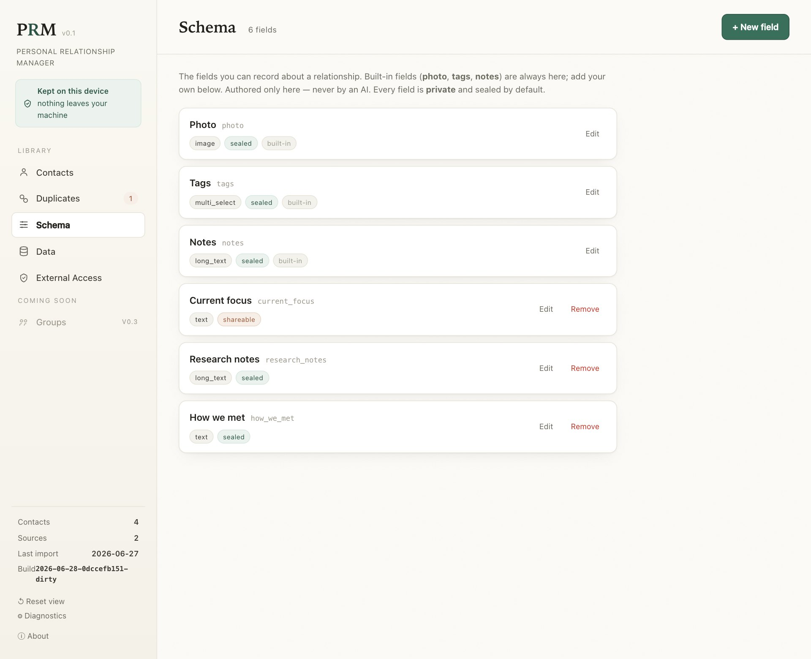
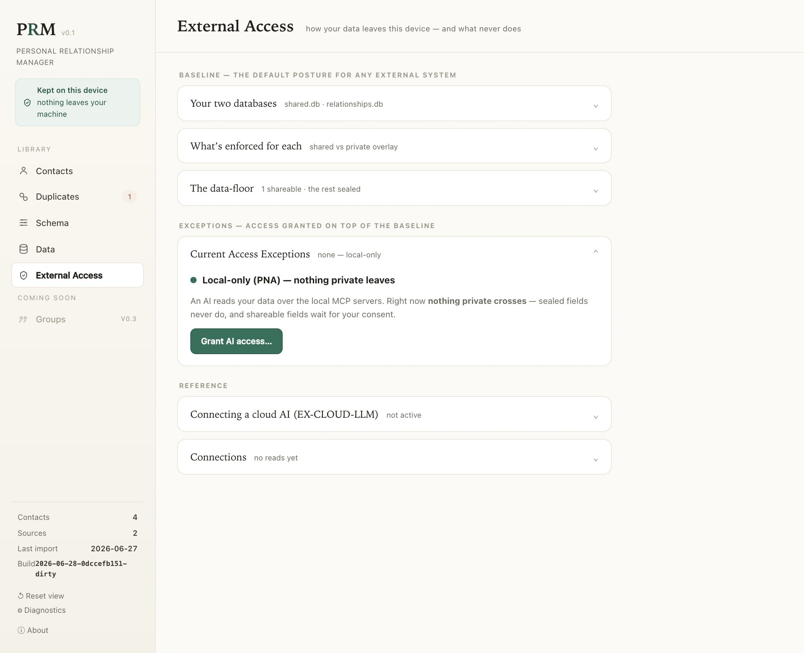
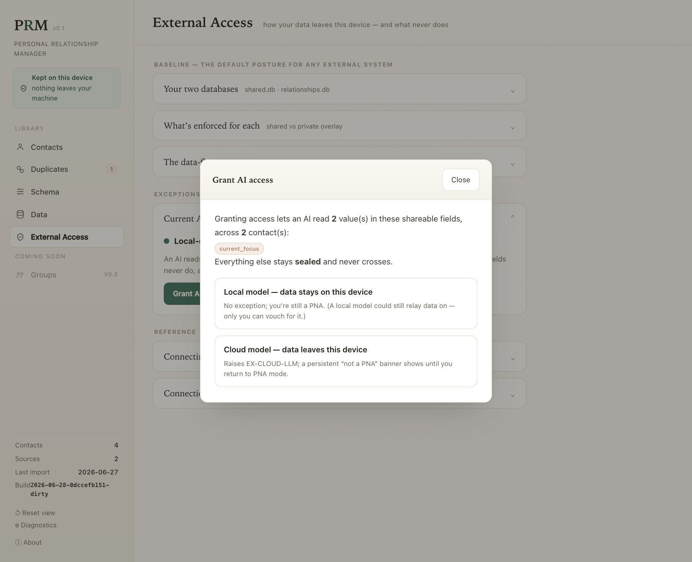
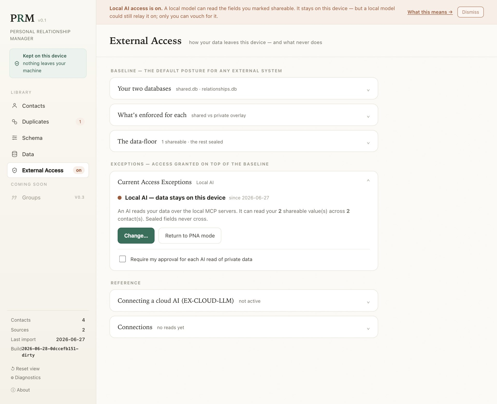
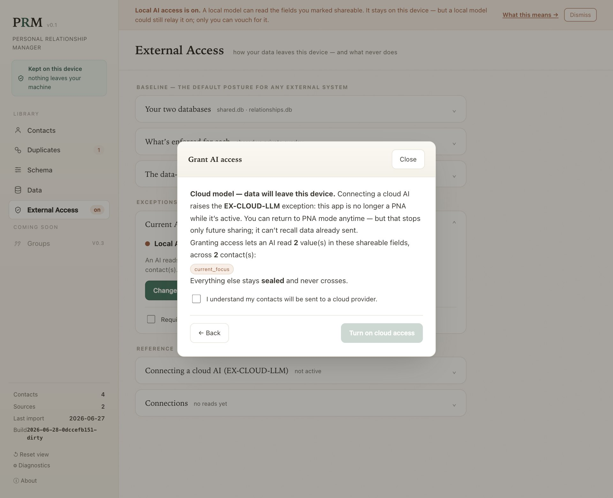
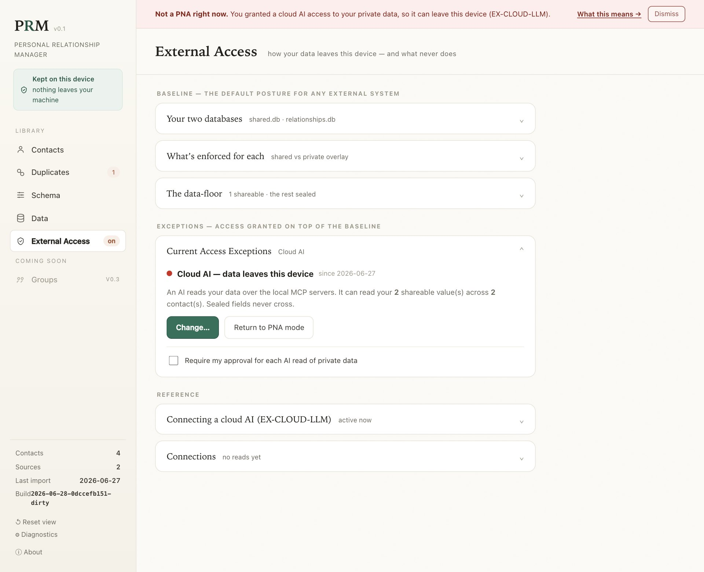
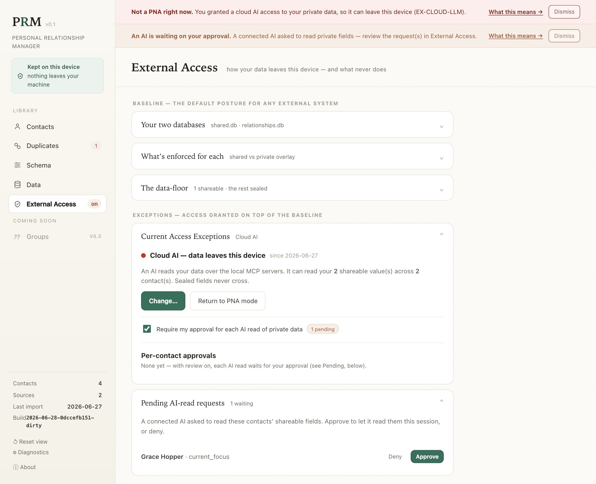
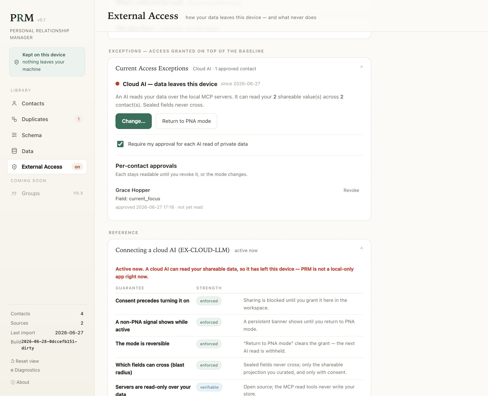
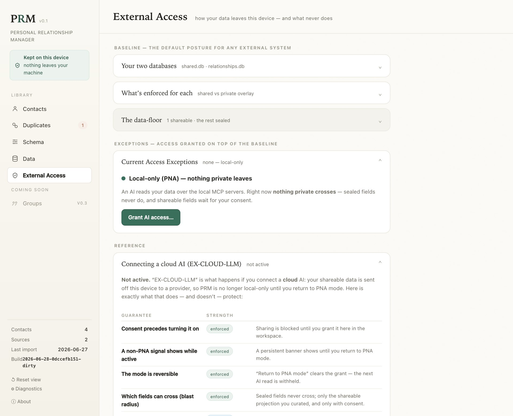
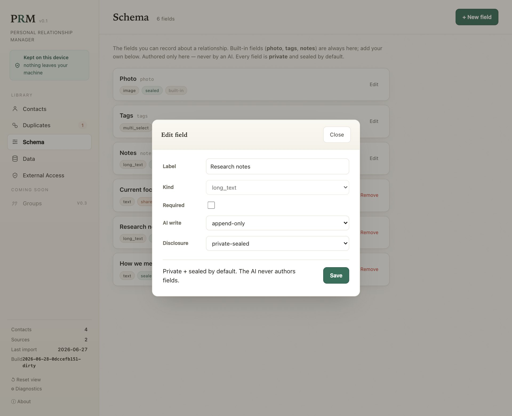

# AI reads & writes — a visual walkthrough

*How PRM lets an AI read and help maintain your relationship data **safely** — what it can see, what it can
change, and exactly what the app shows you at every decision point. An accessible companion to
[How PRM's data works](how-prm-data-works.md) (the data model) and the design notes
[`mcp-cannot-identify-the-consuming-llm.md`](../design-notes/mcp-cannot-identify-the-consuming-llm.md) and
[`ai-writes-and-gathered-data.md`](../design-notes/ai-writes-and-gathered-data.md) (the reasoning).*

> Every screenshot below is the real workspace, driven through each state.

---

## The idea in one minute

You can connect an AI assistant (Claude Desktop, a local model, …) to PRM through small **local MCP
servers** — a standard way for an app to expose tools to an AI. That opens two questions PRM takes very
seriously:

- **Reads** — *what can the AI see?* Your contacts plus a private layer of notes and fields. Some of that
  is sensitive.
- **Writes** — *what can the AI change?* You want help (dedup, gathering missing info) without handing over
  the keys.

PRM's answer to both is the same shape: **a protective default, and explicit, visible, reversible
exceptions on top of it.** Nothing sensitive moves or changes without you seeing it and saying yes. And
crucially, the safety is held by **consent and honest signaling, not by trying to detect which AI is on
the other end** — an MCP server *can't* reliably know that, so PRM never pretends to. It tells you the
truth about what it can and can't guarantee.

The whole control surface lives in one place: the **External Access** tab. It's organized as a
**Baseline** (the default floor that always applies) with **Exceptions** layered on top (anything you've
granted), so you can always answer "what can external systems see right now?" at a glance.

---

# Part 1 — AI reads: what an AI can see

## The data-floor: sealed by default, shareable by choice

Every field you can record about a relationship carries a **disclosure tier**, and the default is
**sealed** — it *never* reaches an AI, in any mode. You can mark a specific field
**shareable-on-consent**, which makes it *eligible* to be read — but only after you grant access (below).

In the **Schema** tab above, the built-in `photo`/`tags`/`notes` and most custom fields are **sealed**;
only *Current focus* has been marked **shareable**. This is the **data-floor**: even with a grant active,
a sealed field is structurally unreadable by the AI — the cloud-facing query never even selects it. So the
most sensitive things you write are off-limits to an AI by construction, not by promise.

## The default state: local-only (PNA)

Open **External Access** and, by default, you're in **PNA mode** — a Personal Network Application,
local-only. Nothing private crosses to any AI.

The page reads top-to-bottom as **Baseline** (your two databases, what's enforced for each, the
data-floor) then **Exceptions** (right now: *none — local-only*). The only way data starts flowing is if
*you* press **Grant AI access**.

## Granting access: the consent gate

Pressing **Grant AI access** opens the gate. Before anything is shared, you see the **blast radius** —
exactly which fields, across how many contacts, would become readable — and you choose **local** vs
**cloud**.

Two things to notice: the preview is concrete (*2 values, 2 contacts, the field `current_focus`*; *everything
else stays sealed*), and the two paths are labeled by their **real consequence** — "data stays on this
device" vs "data leaves this device."

## Path A — a local model (no exception)

Choose **Local model** and you've granted a model that runs *on your machine* read access to your
shareable fields. Because the data never leaves the device, **no exception is raised** — you're still a
PNA. A calm amber banner reminds you it's on.

The honest caveat is right in the banner: *a local model could still relay data on; only you can vouch for
it.* PRM can't police what a model does after it reads — it can only be truthful that local is the
stronger posture.

## Path B — a cloud model (the EX-CLOUD-LLM exception)

Choose **Cloud model** and you're about to do the one thing a local-only app is built to avoid: send data
off the device. PRM makes you stop and confirm.

The confirm button is **disabled until you tick the acknowledgement**. This is the named **`EX-CLOUD-LLM`**
exception from the Personal Network Toolkit: connecting a cloud AI is allowed, but only through a handler
that demands **explicit consent before the raise**.

Confirm it, and the app's whole posture changes — visibly:

A persistent **red "Not a PNA right now"** banner now sits above everything until you return to PNA mode,
and the sidebar carries an **on** badge. This is the **persistent non-PNA signal**: while a cloud AI can
read your data, the app never lets you forget it.

### What the cloud exception does — and doesn't — protect

PRM is unusually honest here. Expand the **EX-CLOUD-LLM** reference card and it grades each guarantee by
how strong it actually is — *enforced*, *verifiable*, *best-effort*, *provider-asserted*, or *none*:

The bottom row is the one that matters most: **data already sent to the cloud is gone.** Returning to PNA
mode stops *future* sharing; it cannot recall what already crossed. PRM says so plainly rather than
implying a clean undo it can't deliver.

## Tighter control: approve each read

For either local or cloud, you can turn on **"Require my approval for each AI read of private data."** Now
an AI's attempt to read a contact's shareable fields is **held** instead of answered — it surfaces as a
request for you to approve or deny, one contact at a time.

When an AI asks, a second banner appears ("An AI is waiting on your approval") and the request lands in
**Pending AI-read requests**. Nothing is returned until you click **Approve** — the same "the AI stages, you
dispose" rule PRM uses everywhere, applied to *reads*.

## The exceptions ledger — see and revoke every grant

Approve a request and it becomes a standing **per-contact exception**, itemized so you can audit it: which
contact, which fields, when you approved, and when an AI last read it — each with its own **Revoke**.

Revoking one approval leaves the others in place — unlike *Return to PNA*, which clears everything at once.

## Returning to PNA — one click back to local-only

Whenever you want, **Return to PNA mode** drops the grant. The banners clear, the exceptions empty, and
you're local-only again.

It's reversible as a **mode** — the next AI read is withheld — with the one honest exception the strength
table already named: anything already sent to a cloud can't be unsent.

---

# Part 2 — AI writes: what an AI can change

The goal with writes is **not to forbid them but to make them safe**: the controls exist, you understand
them, and the defaults are the most protective. The safety is **structural** — the AI is simply never
handed a tool that exceeds the limit you set — not a matter of asking it nicely. There are three ways an AI
adds or changes data, and you can see each in the workspace.

## Writes to *your custom fields* — a policy per field

When you design a field, it carries an **AI-write policy**. Open any field's editor:

The **AI write** control has three settings, and the AI's write tool behaves differently per field — it
*can't* do more than the policy allows:

- **review-required** (the default) — the AI can't write directly; its write is **staged for your
  approval**, like a pull request.
- **append-only** — the AI may **add** a value, but **never overwrite or delete** what's there. Your
  values always remain and win on display. (That's the tier set on *Research notes* above — safe to run
  unattended.)
- **free-write** — a direct write, only for low-stakes fields you opt in explicitly. Off by default.

Two lines are never crossed: the AI writes field **values**, never field **definitions** — your schema's
*shape* is yours alone (it says so right in the dialog) — and the **disclosure tier is independent of the
write policy**. That's why *Research notes* can be **append-only *and* sealed**: an AI may add to it, but
can never read it back out. **Writing in and reading out are separate doors.**

## Dedup — the AI proposes, you dispose

The AI can scan for duplicate contacts and **propose** a merge, but there is no "merge" tool on its
surface — only "propose." Its suggestion lands in **Duplicates**, tagged 🤖, for you to review like a pull
request:

You see the AI's reasoning, exactly which records it would combine, and its pick for each conflicting
field — and **nothing happens until you click Approve**. Every merge is reversible (snapshot + Undo), so
even an approval is safe to take back.

## Gathering — the AI suggests a contact field; you promote it

The subtlest case: an AI finds a value for a real contact field — a phone for a name-only friend, a job
title. PRM does **not** let the AI write the contact directly. It files an **observation**: an additive,
attributed suggestion that waits for you under **"Gathered — pending your review."**

This one screen shows two write types at once. The **Research notes** line under *Your notes & fields* is an
**append-only** AI value that simply landed (non-destructive, attributed to where it was found). The
**Gathered** cards below are **observations**: each shows the value, where the AI found it, and its
confidence, with **Accept** / **Reject**. **Accept** folds it into your view as a reversible private
override (your imported records are never touched); **Reject** dismisses it; leaving it is **Skip**.

The hard rule: **there is no "promote" tool anywhere on the AI surface.** An AI can *suggest* a contact
value but can **never** make it the default — that's always a human click here in the workspace.

---

## The semantics, summarized

**Reads — what an AI can see**

| Control | What it does | Strength |
| --- | --- | --- |
| **Sealed by default** | every field is sealed unless you mark it shareable; sealed is unreadable in any mode | enforced (query-layer) |
| **Consent gate** | nothing shareable crosses until you grant access in the workspace | enforced |
| **Blast-radius preview** | you see which fields × how many contacts before consenting | enforced |
| **Local vs cloud** | cloud raises `EX-CLOUD-LLM`; a persistent "not a PNA" banner shows | enforced (signal) |
| **Per-read approval** (optional) | each AI read is held for your Approve/Deny, per contact | enforced |
| **Revoke / Return to PNA** | drop one grant, or all of them; the next read is withheld | enforced (mode only) |
| **Data already sent** | cannot be recalled once it has left the device | none — irreversible |
| **Which model is on the other end** | PRM can't detect it; the boundary is consent + honesty, not identification | not enforceable |

**Writes — what an AI can change**

| Path | What the AI can do | Who commits it |
| --- | --- | --- |
| **Dedup** | *propose* a merge (no merge tool exists) | you approve in Duplicates |
| **Custom field — review-required** (default) | *stage* a value for review | you approve |
| **Custom field — append-only** | *add* a value, never overwrite/delete; size- + quota-bounded | applied, but non-destructive + reversible |
| **Custom field — free-write** | *set* a value directly (opt-in, low-stakes only) | applied directly |
| **Contact field (canonical)** | *file an observation* (suggestion only) | you promote it (no AI promote tool) |
| **Field definitions / your schema** | **nothing** — the AI never authors the shape of your data | you only (INV-3) |

The throughline for both halves: **the AI assists, but the irreversible, identity-defining, or
off-device steps are always a deliberate human action you can see — and, where the laws of physics allow,
undo.** Where they don't (data already sent to a cloud), PRM tells you so instead of pretending otherwise.

---

## Honest limits (the part most tools skip)

- **PRM cannot identify the AI on the other end of an MCP connection.** Client identity is self-reported;
  the safety comes from consent + signaling, never from detection. (See
  [`mcp-cannot-identify-the-consuming-llm.md`](../design-notes/mcp-cannot-identify-the-consuming-llm.md).)
- **A cloud provider's handling of your data is the provider's policy**, graded *provider-asserted* — PRM
  can't verify it, and says so.
- **Your data lives in ordinary files on disk.** Any program running as your user account — including an
  OS-level AI agent you've granted that access — can read those files directly, outside everything above.
  That boundary is the operating system's, not something an app can close from inside. (See the
  [User's Guide → Privacy](../users-guide.md#privacy).)
